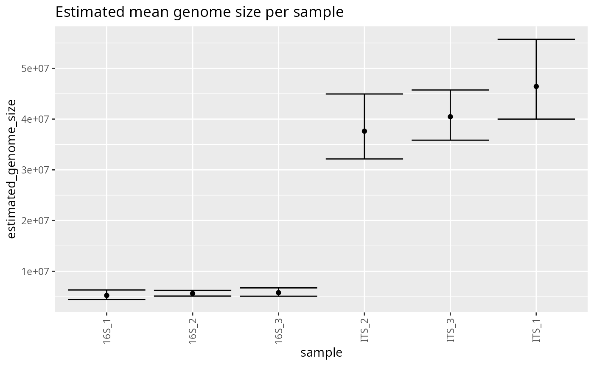
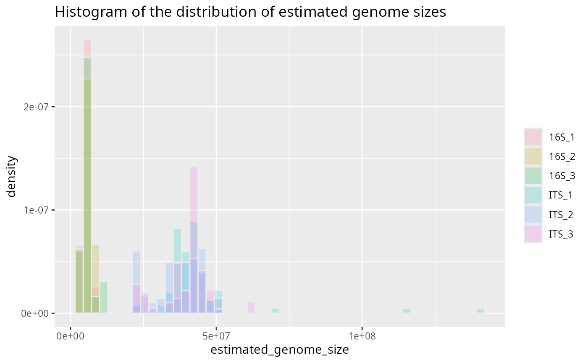
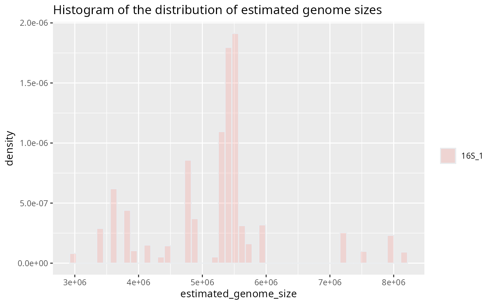
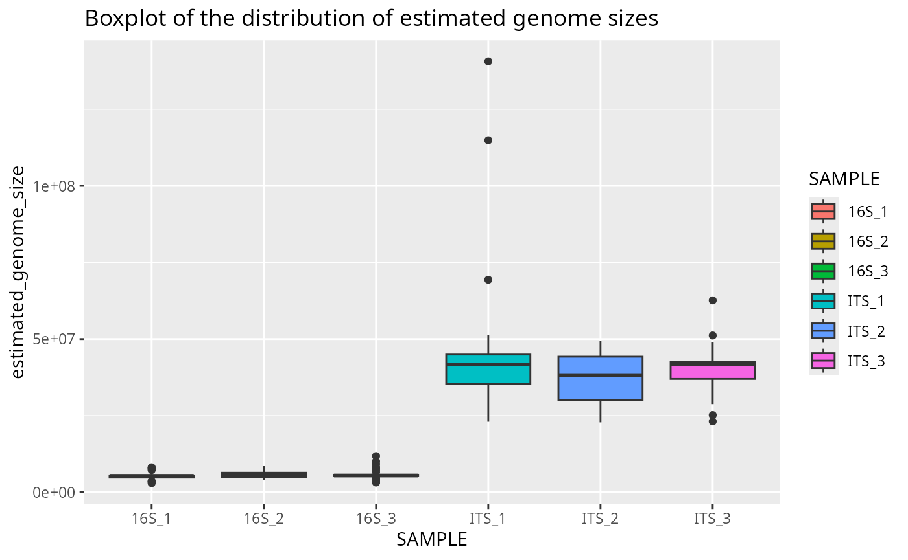
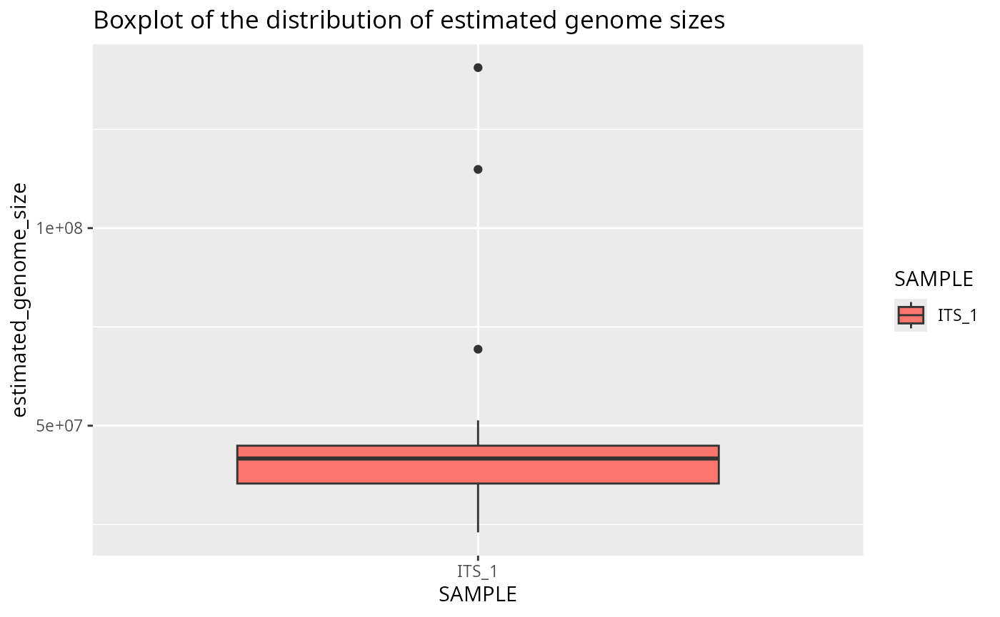
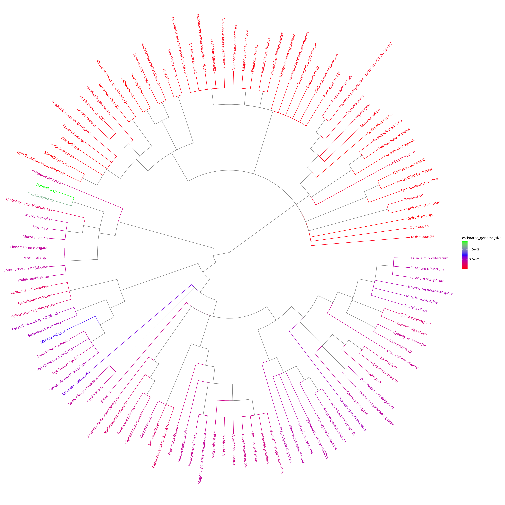

# Get started

#### Simple tutorial using default bayesian method on example file

If not already done, download the archive containing the reference
databases and the bayesian models from `zenodo.org`, using the
`inborutils` package. You can change the `path` option to where you want
to download the archive (default is current directory ‘.’):

    remotes::install_github("inbo/inborutils")
    inborutils::download_zenodo("10.5281/zenodo.13733183", path=".")

Store the path to the archive containing the reference databases and the
bayesian models:

    refdata_archive_path = "path/to/genomesizeRdata_v1.0.3.tar.gz"

Read the example input file from the package. This example data is a
subset of the dataset from [Labouyrie et
al. 2023](https://doi.org/10.1038/s41467-023-37937-4):

    example_input_file = system.file("extdata", "example_input.csv", package = "genomesizeR")

Load the package:

    library(genomesizeR)

Run the main function to get the estimated genome sizes (with the
default method which is the bayesian method):

    results = estimate_genome_size(example_input_file, refdata_archive_path, 
                                   sep='\t', match_column='TAXID', output_format='input', 
                                   ci_threshold = 0.5)
      
      #############################################################################
      # Genome size estimation summary:
      #
      #  50.55556 % estimations achieving required precision
      #
           Min.   1st Qu.    Median      Mean   3rd Qu.      Max. 
        2973116   5404298  17307947  23865759  41709153 140613929 
      
      # Estimation status:
      Confidence interval to estimated size ratio > ci_threshold   OK 
                                                              89   91

#### Estimate genome sizes per sample

To get one mean genome size estimation per sample instead of one
estimation per query, first run the main function with
`return_posterior = TRUE` to keep the full posterior distribution of
each query:

    results = estimate_genome_size(example_input_file, refdata_archive_path, 
                                   sep='\t', match_column='TAXID', output_format='input', 
                                   ci_threshold = 0.5, return_posterior = TRUE)

Then give the results and an abundance table (one row per query, one
column per sample) to
[`estimate_genome_size_per_sample()`](https://scionresearch.github.io/genomesizeR/reference/estimate_genome_size_per_sample.md).
Here the abundance table is built from the COUNT and SAMPLE columns of
the example input:

    samples = unique(results$SAMPLE)
    otu_table = sapply(samples, function(s) ifelse(results$SAMPLE == s, as.numeric(results$COUNT), 0))

    per_sample = estimate_genome_size_per_sample(results, otu_table)

      #############################################################################
      # Genome size estimation per sample summary:
      #
      #  6  samples,  0  without estimation
      #
          Min.  1st Qu.   Median     Mean  3rd Qu.     Max. 
       5249522  5675376 21620693 23491388 39809994 46224058 

      # Proportion of sample abundance with an estimation:
         Min. 1st Qu.  Median    Mean 3rd Qu.    Max. 
            1       1       1       1       1       1 

Each sample gets a mean genome size, weighted by the abundance of its
queries, and an interval for that mean that accounts for the estimation
uncertainty in the genome size of every query:

    per_sample

        sample estimated_genome_size confidence_interval_lower confidence_interval_upper n_queries_used n_queries_total abundance_covered
      1  16S_2               5634618                   5155614                   6214341             30              30                 1
      2  16S_1               5249522                   4428505                   6258701             30              30                 1
      3  ITS_3              40598747                  35995988                  46607566             30              30                 1
      4  ITS_2              37443735                  32168521                  44663036             30              30                 1
      5  ITS_1              46224058                  39567336                  55204951             30              30                 1
      6  16S_3               5797651                   5078372                   6776126             30              30                 1

With a phyloseq object:

    results = estimate_genome_size(as.data.frame(tax_table(pseq)), refdata_archive_path,
                                   format = 'tax_table', return_posterior = TRUE)
    per_sample = estimate_genome_size_per_sample(results, as(otu_table(pseq), "matrix"),
                                                 taxa_are_rows = taxa_are_rows(pseq))

See
[`?estimate_genome_size_per_sample`](https://scionresearch.github.io/genomesizeR/reference/estimate_genome_size_per_sample.md)
for the weighting options.

#### Plot the estimated genome size of each sample

The results can be visualized using the plotting functions provided.
This plot shows the genome size estimated for each sample, with its
confidence interval:

``` r
  plotted_df = plot_genome_size_per_sample(per_sample)
```



#### Plot the distribution of query genome sizes in each sample

The plots below use the results of the main function (one estimation per
query). This histogram shows the distribution of the estimated genome
sizes of the queries in each sample:

``` r
  plotted_df = plot_genome_size_histogram(results)
```



#### Same histogram for one sample

``` r
  plotted_df = plot_genome_size_histogram(results, only_sample='16S_1')
```



#### Boxplot of query genome sizes in each sample

``` r
  plotted_df = plot_genome_size_boxplot(results)
```



#### Same boxplot for one sample

``` r
  plotted_df = plot_genome_size_boxplot(results, only_sample='ITS_1')
```



#### Plot a simplified taxonomic tree with colour-coded genome sizes

This tree shows the taxonomic relationships between the queries and
their estimated genome sizes. The difference between bacteria (16S
marker) and fungi (ITS marker) is visible.

``` r
  plotted_df = plot_genome_size_tree(results, refdata_archive_path)
```

    ## Untarring reference data
    ## Using reference data in: /tmp/RtmpW6qHgH/refdata
    ## Untarring taxonomy
    ## Using taxonomy: /tmp/RtmpW6qHgH/taxdump


