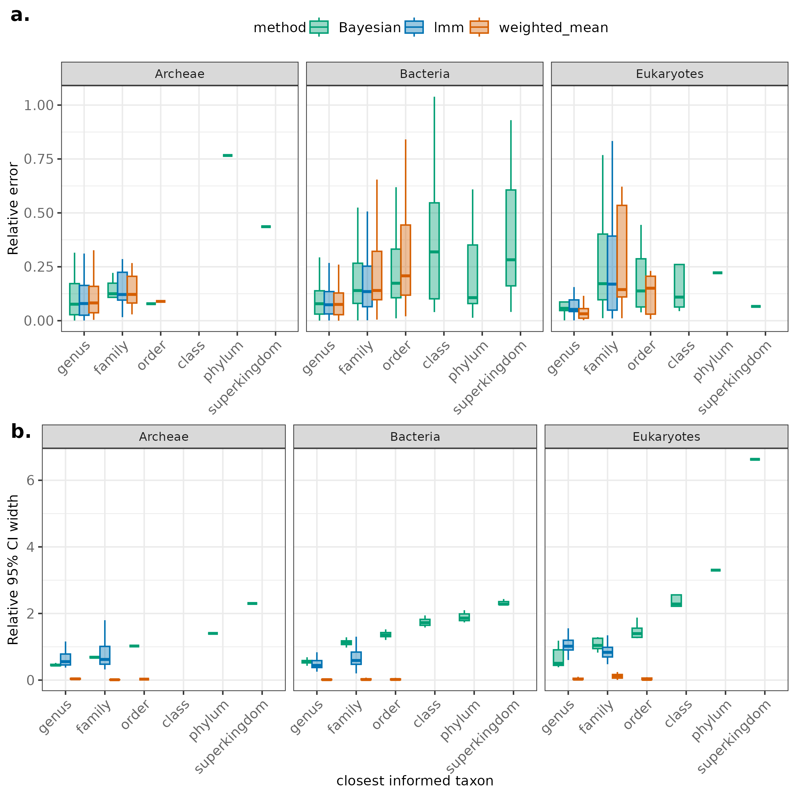

# Summary

The genome size of organisms present in an environment can provide many insights into evolutionary and ecological processes at play in that environment. The genomic revolution has enabled a rapid expansion of our knowledge of genomes in many living organisms, and most of that knowledge is classified and readily available in the databases of the National Center for Biotechnology Information (NCBI). The `genomesizeR` tool leverages the wealth of taxonomic and genomic information present in NCBI databases to infer the genome size of Archeae, Bacteria, or Eukaryote organisms identified at any taxonomic level. 
This R package uses statistical modelling on data from the most up-to-date NCBI databases and provides three statistical methods for genome size prediction of a given taxon, or group of taxa. A straightforward 'weighted mean' method identifies the closest taxa with available genome size information in the taxonomic tree, and averages their genome sizes using weights based on taxonomic distance. A frequentist random effect model uses nested genus and family information to output genome size estimates. Finally, a third option provides predictions from a distributional Bayesian multilevel model which uses taxonomic information from genus all the way to superkingdom, therefore providing estimates and uncertainty bounds even for under-represented taxa.

All three methods use:

  - A list of queries; a query being a taxon or a list of several taxa. The package was designed to make it easy to use with data coming from environmental DNA experiments, but works with any table of taxa.
  - A reference database containing all the known genome sizes, built from the NCBI databases, with associated taxa, provided in an archive to download.
  - A taxonomic tree structure as built by the NCBI, provided in the same archive.

`genomesizeR` retrieves the taxonomic classification of input queries, estimates the genome size of each query, and provides 95% confidence intervals for each estimate. Several plotting functions are also provided to visualise the results.

# Statement of need

The size of microbial genomes and its evolution can provide important insights into evolutionary and ecological processes influencing both microbial species and the environments they inhabit. The shedding of unnecessary genetic elements and their associated biosynthetic pathways, for example, is a common phenomenon observed in organisms with a high degree of host symbiosis [@moran2002microbial; @brader2014metabolic; @vandenkoornhuyse2007active]. Genome size reduction has also been observed in organisms experiencing arid environments [@liu2023warmer], or a narrow range of substrates or metabolic options [@tyson2004community]. Among many others, these findings demonstrate the opportunities associated with including genome size as a key trait in studies on microbial communities to provide insights spanning niche size, co-evolution, adaption, and metabolic flexibility of the microbiomes present, but also stability, and ecophysiological and functional complexity of abiotic and biotic environments.   

However, characterizing genome size for all organisms in a microbiome remains challenging. The exponentially growing genome databases are an inexpensive resource unlocking a myriad of research opportunities in all fields of environmental sciences, but genome size estimates for many taxa found in environmental samples are missing from public databases, or fully unknown. The evolutionary rule that phylogenetically related organisms share genetic similarities can be exploited, and genome size for taxa with unknown genome size can be statistically inferred from related taxa with known genome size, using taxonomy as a proxy for phylogeny. Another challenge is the precision of identification: some taxa can only be identified at high taxonomic levels. Statistical methods can also be used to infer their genome size range from databases. To our knowledge, there is no convenient and fast way to obtain genome size estimates with uncertainty bounds for all organisms identified or partially identified in an environmental sample.

Using the increased prevalence of whole-genome information for all organisms, we have therefore developed `genomesizeR`, allowing the inference of genome size of many queries at once, based on taxonomic information and available genome data from the NCBI.

# Methods

## NCBI database filtering and processing

The reference database is built by querying all genome metadata information from the curated NCBI RefSeq database [@OLeary2016-kw]. Filters are applied to only keep full genomes, and discard data that the NCBI has tagged as anomalous, and sizes labelled abnormally large or small.

This raw database is then prepared to include more pre-computed information to be used by the package. Genome sizes are aggregated to the species level by iteratively averaging all entries at lower ranks, and estimated standard errors for each species with multiple genome size entries are stored. The package can therefore only provide estimates at the level of species and above. Average genome sizes and their associated standard error values are also pre-computed, to be used by the weighted mean method. 

## Bayesian method

The NCBI database of species with known genome sizes was split by superkingdom (Bacteria, Archeae, Eukaryotes). A distributional Bayesian linear hierarchical model using the `brm` function from the `brms` package [@burkner2021brms] was fitted to each superkingdom dataset. The general model structure is outlined below and corresponds exactly to the most complex model, implemented for the Bacteria superkingdom. This general model was simplified by dropping the class group effect in the standard deviation model for the Eukaryote superkingdom, and dropping both the class and phylum group effect in the standard deviation model for the Archeae superkingdom. The latter is therefore not addressed using a distributional model, as the response variance has no predictor. The model is as follows:

\begin{gather*}
log(G_i) \sim \mathcal{N}(\mu_i, \sigma_{i}^2)
\end{gather*}

where $G_i$ is the genome size of species $i$ in the units of 10 Mbp. The model uses taxonomic levels as predictors, and is described in more detail in the package vignettes.

The estimation process uses Stan's Hamiltonian Monte Carlo algorithm with the U-turn sampler. 

Posterior predictions are obtained using the `predict` function from the `brms` package, and 95% credible intervals are obtained using 2.5% and 97.5% quantiles from the posterior distribution. 

Queries corresponding to identified species with an available genome size estimate in the NCBI database get allocated the genome size value of the database (averaged at the species level) and 95% confidence intervals are calculated based on the standard error of the mean of all genome sizes available for that species in the processed NCBI database.

## Frequentist method

A frequentist linear mixed-effects model (LMM) using the `lmer` function from the `lme4` package [@bates2015lme4] was fitted to the NCBI database of species with known genome sizes. The model is as follows:

\begin{gather*}
log(G_i) =  \alpha_0 + \alpha_{genus_{g[i]}} +  \alpha_{family_{f[i]}} + e_i \\
\end{gather*}
where $\alpha_0$ is the overall mean, $\alpha_{genus_{g[i]}}$ and $\alpha_{family_{f[i]}}$ are random effect of genus and family for genus $g[i]$ and family $f[i]$ and $e_i$ is the residual error of observation $i$. 

The estimation process uses the restricted maximum likelihood method (REML). A prediction interval is computed using the `predictInterval` function from the `merTools` package [@knowles2024mertools]. As higher nested levels (order, class) are not taken into account in the model, predictions produced for queries above the family level are not to be trusted. 

Queries corresponding to identified species with an available genome size estimate in the NCBI database get allocated the genome size value of the database (averaged at the species level) and 95% confidence intervals are calculated based on the standard error of the mean of all genome sizes available for that species in the processed NCBI database.

## Weighted mean method

The weighted mean method computes the genome size of a query by averaging the known genome sizes of surrounding taxa in the taxonomic tree, with a weighted system where further neighbours have less weight in the computed mean. The identification of related taxa is limited to levels below and including order.

The pseudocode describing the algorithm for the estimate and confidence interval computation is available in the package vignettes.

For queries relating to well-characterised species where many genetic studies have been performed, such as model organisms, this might lead to more precise predictions than the two other methods. This method can also perform better than the others if queries consist of lists of taxa (for example, an output of *blastn* where several matches can be obtained for each query). Otherwise, we suggest using one of the other methods, as the confidence intervals calculated are less reliable for the weighted mean method.

# Implementation

The main steps of all methods are multithreaded on POSIX systems using the packages parallel [@R2024] and doParallel [@weston2022doparallel].

The packages ncbitax [@ncbitax2020] and CHNOSZ [@Dick2019-nl] are used to read the taxonomy data, dplyr [@dplyr2023] and biomformat [@biomformat2024] are used for some of the formatting, and pbapply [@pbapply2023] is used to display the progress bar.

The R package accepts as input formats the common 'taxonomy table' format used by popular packages such as phyloseq [@phyloseq2013] and mothur [@schloss_introducting_2009], and any file or data frame with a column containing either NCBI taxids or taxon names. The output format is a data frame with the same columns as the input, with some added columns providing information about the estimation and the quality of the estimation. The user can also choose a simple output format only containing the estimation information.

# Method validation and comparison

Each method was quality-controlled by splitting the species-level database into a training set and a validation set. Sampling the validation set involved a level of stratification to obtain a sample representing all match ranks (rank of the closest taxon represented in the training set). Estimation error and confidence bounds were assessed for each method on the same validation set.

Not all queries are estimable by all methods. As stated above, the identification of taxa related to a query in the weighted mean method is limited to ranks below and including order, and only performs an estimation for queries that have at least two such matches.  Valid estimations from the frequentist LMM method are limited to match ranks below and including family. Only the Bayesian method can output results for any taxon that is recognised in the NCBI taxonomy.

\autoref{fig:validation} shows summaries of estimation error relative to the size of the genome, and 95% confidence interval widths relative to the size of the genome, for all successful estimations from the validation set, per method, match rank, and superkingdom. The magnitude and variability of estimation error increases as match rank increases, for all methods. Relative errors seem similar across methods for low match ranks (genus and family), with a slightly better performance of the weighted mean method for match ranks at the genus levels in the Eukaryote superkingdom. Confidence interval widths also increases as match rank increases for the model-based methods, while the weighted mean method has narrow confidence intervals across match ranks. 

To assess the adequacy of estimated confidence intervals in each method, the number of true genome sizes contained between the estimated confidence bounds across the validation set was added up across two groups of low match ranks (genus and family) and high match ranks (above family). We would expect an adequate model to have around 95% of true values falling within 95% confidence intervals. The Bayesian method performs as expected across the two groups (\autoref{table:CI_coverage}). The frequentist LMM method only has a coverage of 83% over the estimable group, suggesting that 95% confidence intervals might not always be fully reliable. The weighted mean method does not perform well in confidence interval estimation.  

{ width=100% }

| Method | Match rank genus or family | Match rank above family | 
| -- | -- | -- |
| Bayesian | 96/99 (97%) | 326/340 (96%) |
| Frequentist LMM | - | 283/340 (83%) |
| Weighted mean | 1/60 (2%) | 27/337 (8%) |
 
 : Observed coverage of 95% confidence intervals for each method and two different rank groups, obtained from the validation process. \label{table:CI_coverage}

The strengths and limitations of each method are outlined in \autoref{table:method_comp}. We emphasise that the weighted mean method is only suitable for taxa that are well-characterised at low taxonomic levels, and when uncertainty bounds are of minor interest. The major advantage of the method is that it can be used on queries with several potential taxonomic matches. The Bayesian method is the most reliable method especially for quantifying uncertainty around estimated means, and obtaining estimates for taxa that are not well represented at low ranks in the NCBI database.

| | CI estimation	| Model information	| Behaviour with well-studied organisms	| Query is a list of several taxa	| Minimum number of references needed for estimation |
| -- | -- | -- | -- | -- | -- |
| Bayesian | very reliable | any rank | + | + | 1 |
| LMM | mostly reliable | up to family level | + | + | 1 |
| Weighted mean | unreliable | up to order level | ++ | ++ | 2 |

: Comparison of method behaviour and applicability \label{table:method_comp}

# Availability

- Project name: genomesizeR
- Project home page: https://github.com/ScionResearch/genomesizeR 
- Operating system(s): Platform independent
- Programming language: R
- License: GNU General Public License

# Acknowledgements

The authors declare that they have no conflict of interest. Funding for this research came from the Tree-Root-Microbiome programme, which is funded by MBIE’s Endeavour Fund and in part by the New Zealand Forest Growers Levy Trust (C04X2002). We make no warranties regarding the accuracy or integrity of the Data. We accept no liability for any direct, indirect, special, consequential or other losses or damages of whatsoever kind arising out of access to, or the use of the Data. We are in no way to be held responsible for the use that you put the Data to. You rely on the Data entirely at your own risk.

# References
