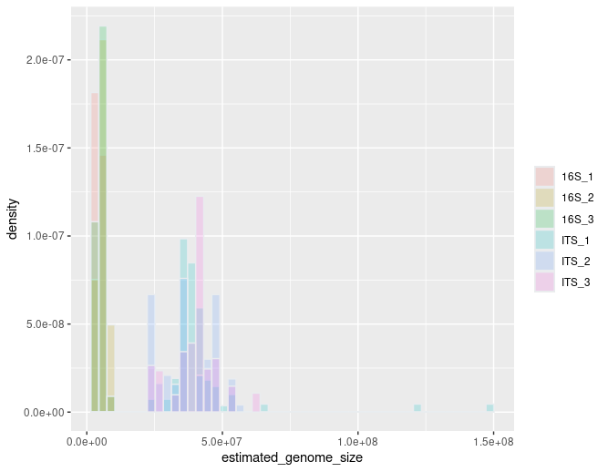

# Summary

The purpose of this R package is to implement tools that allow the inference of genome size based on taxonomic information and available genome data from the National Center for Biotechnology Information (NCBI).

This R package offers three different methods for genome size prediction: a bayesian linar hierarchical model, a hierarchical linear mixed-effects model, and a weighted mean method.

The methods use:

  - A list of queries; a query being a taxon or a list of several taxa.
  - A reference database containing all the known genome sizes, built from the NCBI databases, with associated taxa.
  - A taxonomic tree structure as built by the NCBI

`genomesizeR` estimates the genome size of each query, with a confidence interval on the estimation.

# Statement of need

Ask Steve?

# From the journal to write equations:

Single dollars ($) are required for inline mathematics e.g. $f(x) = e^{\pi/x}$

Double dollars make self-standing equations:

$$\Theta(x) = \left\{\begin{array}{l}
0\textrm{ if } x < 0\cr
1\textrm{ else}
\end{array}\right.$$

You can also use plain \LaTeX for equations
\begin{equation}\label{eq:fourier}
\hat f(\omega) = \int_{-\infty}^{\infty} f(x) e^{i\omega x} dx
\end{equation}
and refer to \autoref{eq:fourier} from text.

# Methods

## Bayesian method

A Bayesian linar hierarchical model using the brm function from the brms package is used for each superkingdom (Bacteria, Archeae, Eukaryotes), following the model below:

\begin{equation}
log(G) \sim \mathcal{N}(\mu, \sigma^2) \\
\mu = \mu_0 + \alpha_{genus} \\
\alpha_{genus} \sim \mathcal{N}(\alpha_{family}, \sigma_{genus}^2) \\
\alpha_{family} \sim \mathcal{N}(\alpha_{order}, \sigma_{family}^2) \\
\alpha_{order} \sim \mathcal{N}(\alpha_{class}, \sigma_{order}^2) \\
\alpha_{class} \sim \mathcal{N}(\alpha_{phylum}, \sigma_{class}^2) \\
\alpha_{phylum} \sim \mathcal{N}(0, \sigma_{phylum}^2) \\
\mu_0 \sim \mathcal{N}(0,5) \\
(\sigma,\sigma_{genus},\sigma_{family},\sigma_{order},\sigma_{class},\sigma_{phylum}) \sim \mathcal{N}^+(0,1) \\
\end{equation}

where $G$ is the genome size in the units of 10 Mbp and $\mathcal{N}^+$ is the normal distribution truncated to positive values.

The estimation process uses Stan's Hamiltonian Monte Carlo algorithm with the U-turn sampler. Credible intervals are obtained using quantiles from the posterior distribution.

## Hierarchical method

A hierarchical linear mixed-effects model using the lmer function from the lme4 package, based on the known genome sizes at the genus and family levels as follows:  

lmer(log(genome_size) ~ (1|family/genus), data)

A prediction interval is computed using the predictInterval function from the merTools package.

## Weighted mean method

The weighted mean method computes the genome size of a query by averaging the known genome sizes of surrounding taxa in the taxonomic tree, with a weighted system where further neighbours have less weight in the computed mean.

The confidence interval is calculated as:

```
  standard_error = sqrt(computed_weighted_mean)
  Z = 1.96
  confidence_interval = Z * standard_error
```

# Implementation

The main steps of all methods are multithreaded on POSIX systems (not Windows) using the ### package(s) (ref(s)).

The R package accepts the common 'taxonomy table' format used by popular packages such as phyloseq (ref) and mothur (ref), and any file or dataframe with a colum containing either NCBI taxids or taxon names as input formats. The output format is a data frame with the same columns as the input, with some added columns providing information about the estimation and the quality of the estimation. The user can also choose a simple output format only containing the estimation information.

Several plotting functions using the ggplot2 package (ref) are also provided to visualise the results.

# Very short comparison of the methods?

...

# Example

This example data is a subset of the dataset from (ref).

First, the genome sizes are predicted from the taxa:
```
results = estimate_genome_size(example_input_file, format='csv', sep='\t', match_column='TAXID', output_format='input')

#############################################################################
# Genome size estimation summary:
#
#  8.888889 % estimations achieving required precision
#
     Min.   1st Qu.    Median      Mean   3rd Qu.      Max.
  2893119   5344026  17768591  24126621  42194240 128877284

# Estimation status:
Confidence interval to estimated size ratio > ci_threshold                                                         OK
                                                       164
```

Then, the results can be visualized using the plotting functions provided:
```
plotted_df = plot_genome_size_histogram(results)
```
{ width=100% }

# Citations

Citations to entries in paper.bib should be in
[rMarkdown](http://rmarkdown.rstudio.com/authoring_bibliographies_and_citations.html)
format.

If you want to cite a software repository URL (e.g. something on GitHub without a preferred
citation) then you can do it with the example BibTeX entry below for @fidgit.

For a quick reference, the following citation commands can be used:
- `@author:2001`  ->  "Author et al. (2001)"
- `[@author:2001]` -> "(Author et al., 2001)"
- `[@author1:2001; @author2:2001]` -> "(Author1 et al., 2001; Author2 et al., 2002)"

# Figures

Figures can be included like this:

and referenced from text using \autoref{fig:example}.

Figure sizes can be customized by adding an optional second parameter:
{ width=20% }

# Acknowledgements

We acknowledge contributions from Sean Husher.

# References
