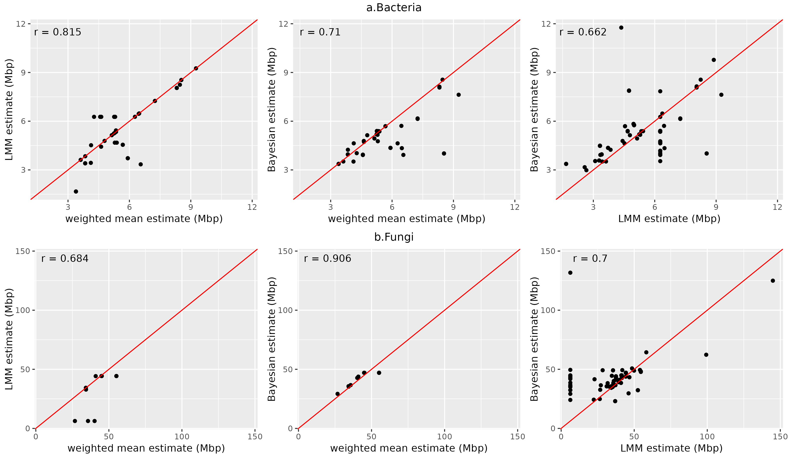
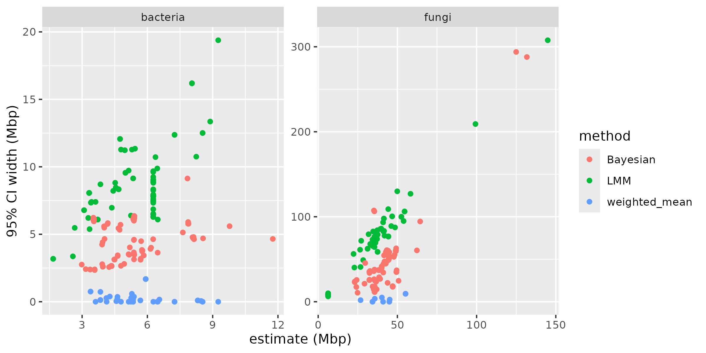
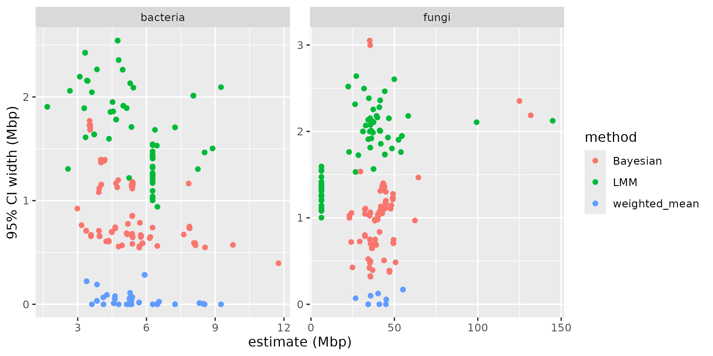

# Summary

The genome size of organisms present in an environment can provide many insights into evolutionary and ecological processes at play in that environment. The genomic revolution has enabled a rapid expansion of our knowledge of genomes in many living organisms, and most of that knowledge is classified and readily available in the databases of the National Center for Biotechnology Information (NCBI). The `genomesizeR` tool leverages the wealth of taxonomic and genomic information present in NCBI databases to infer the genome size of Acheae, Bacteria, or Eukaryote organisms identified at any taxonomic level. 
This R package uses statistical modelling on data from the must up-to-date NCBI databases and provides three statistical methods for genome size prediction at the species level. A straightforward weighted mean method identifies the closest taxa with available genome size information in the taxomic tree and averages their genome sizes using weights based on taxonomic distance. A frequentist random effect model uses nested genus and family information to output genome size estimates. Finally a third option provides predictions from a distributional Bayesian multilevel model which uses taxonomic information from genus all the way to superkingdom, therefore providing estimates and uncertainty bounds even for under-represented taxa.

All three methods use:

  - A list of queries; a query being a taxon or a list of several taxa.
  - A reference database containing all the known genome sizes, built from the NCBI databases, with associated taxa.
  - A taxonomic tree structure as built by the NCBI

`genomesizeR` retrieves the taxonomic classification of input queries, estimates the genome size of each query, and provides 95% confidence intervals for each estimate.

# Statement of need

The size of microbial genomes can provide important insights into evolutionary and ecological processes influencing both microbial species and the environments in which they inhabit. The shedding of unnecessary genetic elements and their associated biosynthetic pathways, for example, is a common phenomenon observed in species with high degree of host symbiosis (Moran 2002). The transition from free-living through to facultative and ultimately obligate symbiosis is typically associated with genome reduction as the microbial taxa make use of metabolites such as amino acids and vitamins produced by the host (Brader et al., 2014), as well as often receiving a steady supply of pre-fixed organic compounds (e.g. Vandenkoornhuyse et al., 2007) driving their heterotrophic respiration. Waste not, want not. 

Genome size is also linked with functional and metabolic repertoire and flexibility. For example, in nutrient deprived ecosystems or where a narrow range of substrates or metabolic options occur, average microbial genome size is reduced; optimisation to the limited lifestyle options available occurs. This is observed, for example, in environments from acid mine drainage to whale fall (Tyson et al., 2004; Raes et al., 2007). Conversely, environments that change frequently in biogeochemical processes, such as the broad range of organoheterotroph substrates or shifting availability terminal electron acceptors, favour microbial taxa with board genetic flexibility leading to agility to shift metabolism to meet changes in environmental conditions.   

Relationships between genome size and environmental conditions and complexity have also been observed. When looking within metagenomic data sets, Raes et al. (2007) found increased effective genome size and environmental complexity and noted the contribution of the Eukaryotic subcommunity to this. Similarly, in a study of 237 bacterial community profiles globally (i.e. from amplicon libraries), Liu et al. (2022) found clear association of environmental aridity and bacterial genome size, surmising that limitation of water availability to microbial growth led to physiological constraints concomitantly reflected in reduction of genome size. Collectively, these findings demonstrate the opportunities associated with utilising genome size as a key trait in microbial communities to provide insights spanning niche size, co-evolution, adaption, and metabolic flexibility of the microbiomes present, but also stability, and ecophysiological and functional complexity of the abiotic and biotic environments in which they inhabit.   

Spanning human and agricultural microbiomes, through to aquatic, soil, and atmospheric ecosystems, there exists a myriad of research opportunities for approaches that can measure or infer microbiome genome sizes. Methods in the past have included use of DNA staining through to cell enumeration, flow cytometry, and culturing, gel electrophoresis, and DNA renaturation kinetics. All have merits and limitations (see comments in Rases et al., 2007). However, the widespread availability and use of microbiome related tag-amplicon DNA sequencing provides a direct modern mechanism. Adding this trait alongside information of community structure as well as project metadata will add further scientific value to investment already made in these projects. Finally, there is an opportunity to explore the rapidly expanding archives of short read DNA libraries (i.e. extant 16S and ITS amplicon sequencing projects on NCBI and elsewhere), providing new insights to these datasets.  

Using the increased prevalence of whole-genome information for all organisms, we have developed this R package that allows the inference of genome size, based on taxonomic information and available genome data from the National Center for Biotechnology Information (NCBI).

# Methods

## Bayesian method

The NCBI database of species with known genome sizes was split by superkingdom (Bacteria, Archeae, Eukaryotes). A distributional Bayesian linear hierarchical model using the brm function from the brms package was fitted to each superkingdom dataset. The general model structure is outlined below.

\begin{equation}
log(G_i) \sim \mathcal{N}(\mu_i, \sigma_{i}^2)
\end{equation}
where $G$ is the genome size in the units of 10 Mbp. The model uses predictors for
both mean and standard deviation. The mean is modelled as follows:
\begin{equation}
\mu_i = \alpha_0 + \alpha_{genus_{g[i]}} + \alpha_{family_{f[i]}} + \alpha_{order_{o[i]}} + \alpha_{class_{c[i]}} + \alpha_{phylum_{p[i]}}  \\
\alpha_{genus_{g[i]}} \sim \mathcal{N}(0, \sigma_{genus}^2) \\
\alpha_{family_{f[i]}} \sim \mathcal{N}(0, \sigma_{family}^2) \\
\alpha_{order_{o[i]}} \sim \mathcal{N}(0, \sigma_{order}^2) \\
\alpha_{class_{c[i]}} \sim \mathcal{N}(0, \sigma_{class}^2) \\
\alpha_{phylum_{p[i]}} \sim \mathcal{N}(0, \sigma_{phylum}^2) \\
\end{equation}
with priors
\begin{equation}
\alpha_0 \sim \mathcal{N}(0,5) \\
(\sigma_{genus},\sigma_{family},\sigma_{order},\sigma_{class},\sigma_{phylum},s_{class},s_{phylum}) \sim \mathcal{N}^+(0,1) \\
\end{equation}

The standard deviation is modelled as follows:
\begin{equation}
log(\sigma_{i}) = \lambda_0 + \lambda_{class_{c[i]}} + \lambda_{phylum_{p[i]}} \\
\lambda_{class_{c[i]}} \sim \mathcal{N}(0, s_{class}^2) \\
\lambda_{phylum_{p[i]}} \sim \mathcal{N}(0, s_{phylum}^2) \\
\end{equation}

with priors
\begin{equation}
\lambda_0 \sim \mathcal{N}(0,1) \\
(s_{class},s_{phylum}) \sim \mathcal{N}^+(0,1) \\
\end{equation}

  $\mathcal{N}^+$ is the normal distribution truncated to positive values. $g[i]$,$f[i]$,$o[i]$,$c[i]$ and $p[i]$ are respectively the index for the genome, family, order, class, and phylum of observation $i$. Note that taxonomic groups are naturally nested within each other and the indices are designed to be unique to the particular taxonomic group it represents.

The estimation process uses Stan's Hamiltonian Monte Carlo algorithm with the U-turn sampler. 

Posterior predictions are obtained using the predict function from the brms package, and credible intervals are obtained using quantiles from the posterior distribution. 

Note that the model was fitted at the species level. The base dataset for the model used a version of the
NCBI database where all entries below the species level were iteratively averaged, starting from the smallest level, until one value was obtained per species.


## Frequentist method

A frequentist linear mixed-effects model using the lmer function from the lme4 package was fitted to the NCBI database of species with known genome sizes. The model is as follows:

\begin{equation}
log(G_i) =  \alpha_0 + \alpha_{genus_{g[i]}} +  \alpha_{family_{f[i]}} + e_i \\
\end{equation}
where $\alpha_0$ is the overall mean, $\alpha_{genus_{g[i]}}$ and $\alpha_{family_{f[i]}}$ are random effect of genus and family for genus $g[i]$ and family $f[i]$ and $e_i$ is the residual error of observation $i$. 

The estimation process using the restricted maximum likelihood method (REML). Models with additional higher nested levels (order, class) were tested but led to convergence failure of the REML algorithm.
A prediction interval is computed using the predictInterval function from the merTools package.

As for the Bayesian method, the model was fitted at the species level. The base dataset for the model used a version of the NCBI database where all entries below the species level were iteratively averaged, starting from the smallest level, until one value was obtained per species.

## Weighted mean method

The weighted mean method computes the genome size of a query by averaging the known genome sizes of surrounding taxa in the taxonomic tree, with a weighted system where further neighbours have less weight in the computed mean.

The confidence interval is calculated as:

\begin{equation}
CI = 1.96 \times \sqrt{\hat{\mu}}
\end{equation}

where $\hat{\mu}$ is the computed weighted mean.


Note that this method allows for estimation below the species level. For queries relating to well-characterised species where many genetic studies have been performed, this might lead to more precise predictions than the two other methods. Otherwise, we suggest using one of the other methods.

# Implementation

The main steps of all methods are multithreaded on POSIX systems (not Windows) using the ### package(s) (ref(s)).

The R package accepts the common 'taxonomy table' format used by popular packages such as phyloseq (ref) and mothur (ref), and any file or dataframe with a colum containing either NCBI taxids or taxon names as input formats. The output format is a data frame with the same columns as the input, with some added columns providing information about the estimation and the quality of the estimation. The user can also choose a simple output format only containing the estimation information.

Several plotting functions using the ggplot2 package (ref) are also provided to visualise the results.

# Comparison of methods

The applicability of each method varies. The Bayesian method outputs results for any taxon that is recognised in the NCBI taxonomy. The frequentist random effects model method only outputs results for queries that have a match at the species, genus, or family level. The weighted means method only performs an estimation for queries that have at least two matches at the species, genus, family, or order level. Below is a comparison of estimates for an example set of bacteria and fungi queries where the highest level of match with the database is the family level. Note that there are fewer successful estimations with the weighted means method than with the two model-based methods. 

Figures below show that estimates and the width of confidence intervals differ between methods (figures \autoref{fig:est_comp}, \autoref{fig:CI_comp} and \autoref{fig:CI_rel_comp}).

{ width=100% }

{ width=75% }

{ width=75% }

# Example

This example data is a subset of the dataset from (ref).

First, the genome sizes are predicted from the taxa:
```
results = estimate_genome_size(example_input_file, format='csv', sep='\t', match_column='TAXID', output_format='input')

#############################################################################
# Genome size estimation summary:
#
#  8.888889 % estimations achieving required precision
#
     Min.   1st Qu.    Median      Mean   3rd Qu.      Max.
  2893119   5344026  17768591  24126621  42194240 128877284

# Estimation status:
Confidence interval to estimated size ratio > ci_threshold                                                         OK
                                                       164
```

Then, the results can be visualized using the plotting functions provided:
```
plotted_df = plot_genome_size_histogram(results)
```
{ width=100% }

# Citations

Citations to entries in paper.bib should be in
[rMarkdown](http://rmarkdown.rstudio.com/authoring_bibliographies_and_citations.html)
format.

If you want to cite a software repository URL (e.g. something on GitHub without a preferred
citation) then you can do it with the example BibTeX entry below for @fidgit.

For a quick reference, the following citation commands can be used:
- `@author:2001`  ->  "Author et al. (2001)"
- `[@author:2001]` -> "(Author et al., 2001)"
- `[@author1:2001; @author2:2001]` -> "(Author1 et al., 2001; Author2 et al., 2002)"

# Figures

Figures can be included like this:

and referenced from text using \autoref{fig:example}.

Figure sizes can be customized by adding an optional second parameter:
{ width=20% }

# Acknowledgements

We acknowledge contributions from Sean Husher.

# References
