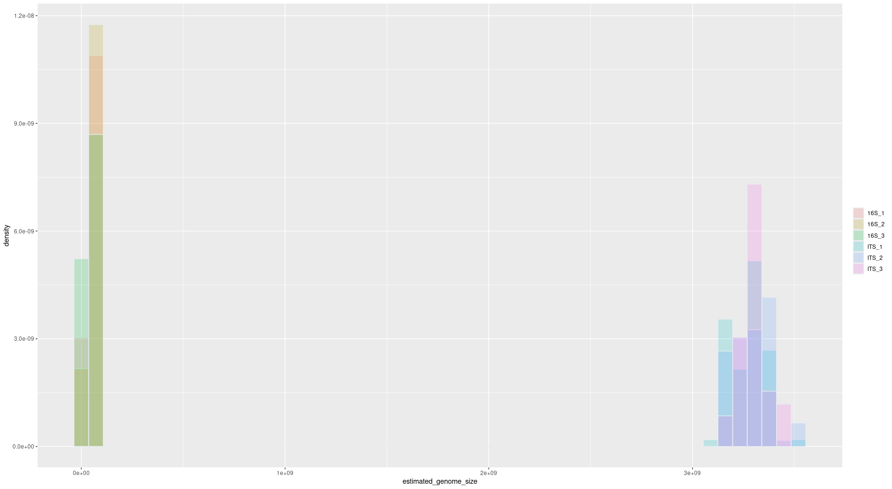

## Introduction

The purpose of this R package is to implement tools that allow the inference of genome size based on taxonomic information and available genome data from the NCBI.

This R package offers three different methods for genome size prediction.

The methods use: 

  - A list of queries; a query being a taxon or a list of several taxa. 
  - A reference database containing all the known genome sizes, built from the NCBI databases, with associated taxa. The database is variably dense depending on the taxon groups. 
  - A taxonomic tree structure as built by the NCBI, imperfectly reflecting the evolutionary distances between taxa, depending on the taxa/subtree. 

`genomesizeR` estimates the genome size of each query, with a confidence interval on the estimation. 

## Methods

### Bayesian method

A Bayesian linar hierarchical model using the brm function from the brms package is used for each superkingdom (Bacteria, Archeae, Eukaryotes), following the model below:

\begin{equation}
log(G) \sim \mathcal{N}(\mu, \sigma^2) \\
\mu = \mu_0 + \alpha_{genus} \\
\alpha_{genus} \sim \mathcal{N}(\alpha_{family}, \sigma_{genus}^2) \\
\alpha_{family} \sim \mathcal{N}(\alpha_{order}, \sigma_{family}^2) \\
\alpha_{order} \sim \mathcal{N}(\alpha_{class}, \sigma_{order}^2) \\
\alpha_{class} \sim \mathcal{N}(\alpha_{phylum}, \sigma_{class}^2) \\
\alpha_{phylum} \sim \mathcal{N}(0, \sigma_{phylum}^2) \\
\mu_0 \sim \mathcal{N}(0,5) \\
(\sigma,\sigma_{genus},\sigma_{family},\sigma_{order},\sigma_{class},\sigma_{phylum}) \sim \mathcal{N}^+(0,1) \\
\end{equation}

where $G$ is the genome size in the units of 10 Mbp and $\mathcal{N}^+$ is the normal distribution truncated to positive values.

The estimation process uses Stan's Hamiltonian Monte Carlo algorithm with the U-turn sampler. Credible intervals are obtained using quantiles from the posterior distribution.

### Hierarchical method

A hierarchical linear mixed-effects model using the lmer function from the lme4 package, based on the known genome sizes at the genus and family levels as follows:  

lmer(log(genome_size) ~ (1|family/genus), data) 

A prediction interval is computed using the predictInterval function from the merTools package. 

### Weighted mean method

The weighted mean method computes the genome size of a query by averaging the known genome sizes of surrounding taxa in the taxonomic tree, with a weighted system where further neighbours have less weight in the computed mean.

The confidence interval is calculated as:

```
  standard_error = sqrt(computed_weighted_mean)
  Z = 1.96
  confidence_interval = Z * standard_error
```

## Implementation

The main steps of both methods are multithreaded on POSIX systems (not Windows). 

The R package accepts the dada2 format, as well as the BIOM format, used by mothur and phyloseq, and any file or dataframe with a colum containing either NCBI taxids or taxon names as input formats. The output format is a data frame with the same columns as the input, with some added columns providing information about the estimation and the quality of the estimation. The user can also choose a simple output format only containing the estimation information. 

## Examples


